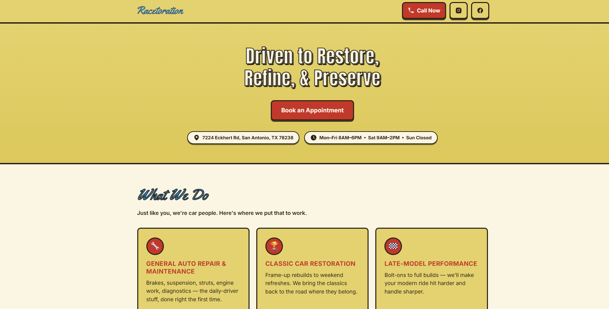
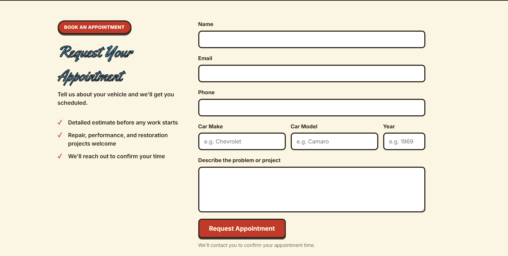
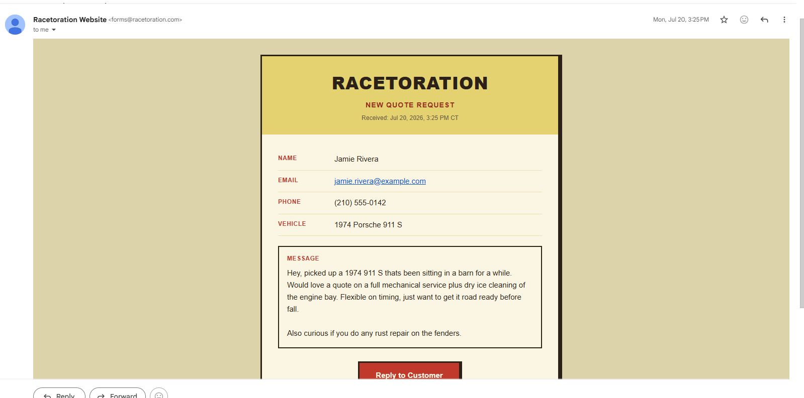

# Racetoration LLC — Website & Booking System

Marketing site and appointment-request system for **Racetoration LLC**, a full-service auto repair and classic car restoration shop in San Antonio, TX.

**Live site:** [racetoration.com](https://racetoration.com)

## Screenshots



### Booking System

The appointment request form collects the customer's contact info and vehicle details, then sends it straight to the shop's inbox as a branded HTML email.

| Request Form | Received Appointment Request |
|---|---|
|  |  |

## Features

- Responsive one-page marketing site — hero, services, before/after gallery, shop info, and about section
- Appointment/quote request form with client-side validation and a honeypot field for bot filtering
- Serverless form handler (Cloudflare Pages Function) that emails submissions via [Resend](https://resend.com), with the requester's address set as reply-to
- CORS locked to the production domain; server-side validation on all required fields

## Tech Stack

- Static HTML/CSS/JS — no build step
- [Cloudflare Pages](https://pages.cloudflare.com/) for hosting and the custom domain (see `CNAME`)
- [Cloudflare Pages Functions](https://developers.cloudflare.com/pages/functions/) for the `/api/contact` endpoint (`functions/api/contact.js`)
- [Resend](https://resend.com) for transactional email delivery

## Project Structure

```
├── index.html              # Site markup
├── styles.css               # Site styles
├── script.js                 # Form handling, interactions
├── functions/api/contact.js  # Serverless endpoint — validates + emails appointment requests
├── assets/images/            # Site imagery
├── CNAME                     # Custom domain for Cloudflare Pages
└── robots.txt
```

## Local Development

This is a static site with a Cloudflare Pages Function, so local development runs through [Wrangler](https://developers.cloudflare.com/workers/wrangler/):

```bash
npx wrangler pages dev .
```

The contact form requires a `RESEND_API_KEY` environment variable (set as a Cloudflare Pages secret in production) to send email.

## Deployment

Pushes to `main` deploy automatically via Cloudflare Pages.
